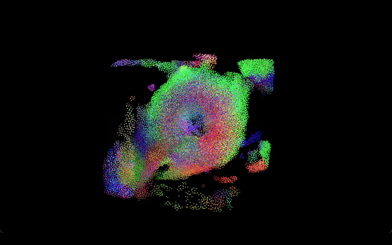
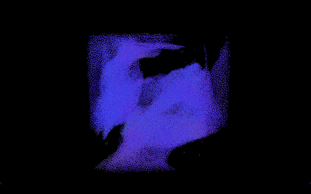
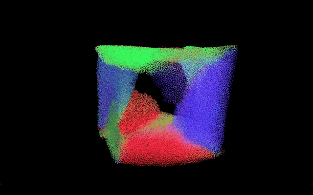
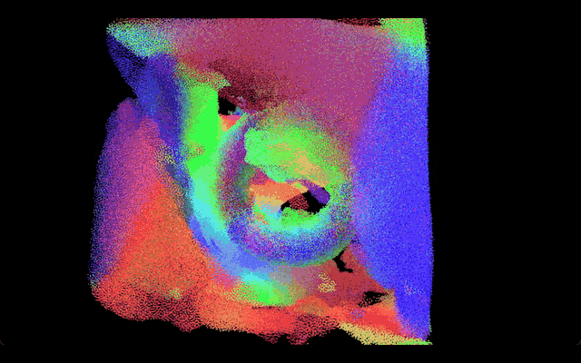
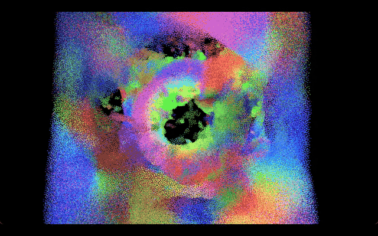
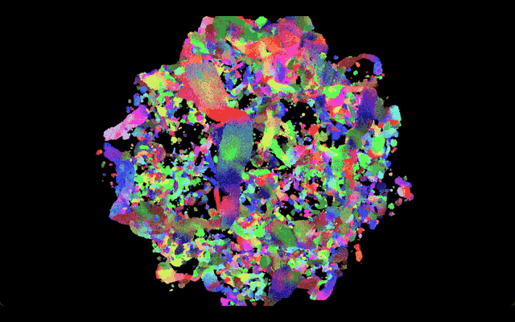

**University of Pennsylvania, CIS 5650: GPU Programming and Architecture,
Project 1 - Flocking**

# The Everything Bagel

<p align="center">
  <br>
  <em>100k boids forming a bagel</em>
</p>

###  specs

- Zachary Leong
  - [LinkedIn](https://linkedin.com/in/zleong), [personal website](https://zacharyleong.com)
- Tested on: Windows 11, Ultra 9 185H @ 2.30GHz 32GB, RTX 4060 Laptop (personal)

### setup

This project was developed in VS Code and I used the CMake Tools Extension to build. Here are additional macros included at the top of each file:

`kernel.cu`
- `AVOIDANCE`: enables the bounds avoidance force
- `TORUS`: enables the torus attraction force
- `MANDELBULB`: enables the mandelbulb attraction force
- `radiusMul`: blockSize = radiusMul * neighbor search radius

`main.cpp`
- `PROFILE_MODE`: enables profile mode (see below)

## boids

boids are particles that independently follow 3 rules:

1. cohesion
2. separation
3. alignment

And from there, emerges complex and beautiful behavior, resembling flocks of birds, or schools of fish.



### optimizations
#### uniform grid
The bounds are partitioned into fixed sized cells, allowing boids to check other boids in neighboring cells, as opposed to pairwise checks (naive implementation).

#### coherent grid
This optimization reorders the position and velocity buffers, keeping boids in the same cell adjacent to each other in memory.

#### smart grid looping
Instead of checking the 8 or 27 surrounding cells, I compute a bounding box of cell indices that we need to check, which changes in according with `radiusMul`. 

### sdf forces

Inspired by Sebastian Lague's [video](https://www.youtube.com/watch?v=bqtqltqcQhw) about boids, I initially attempted to make the boids avoid collisions with objects and the bounds of the simulation (currently they teleport when they are outside of the bounds). However, having each boid perform a number of raycasts to choose a unobstructed direction would be infeasible on the gpu without an acceleartion structure.

Instead, I went with the simpler method: use SDFs and their gradients to influence the boids' velocities. Using the box SDF formula from Inigo Quilez's [blog](https://iquilezles.org/articles/distgradfunctions3d/), I nudged the velocities of boids near the bounds to stay inside.



This is how it works:

An SDF (`sdf(vec3 p)`) tells us the signed distance from the point `p` and some mathematical representation of a shape.

- `p` is inside the shape: `sdf(vec3 p) < 0`
- `p` is outside the shape: `sdf(vec3 p) > 0`
- `p` is on the surface of the shape: `sdf(vec3 p) = 0`

Along with the distance, for certain sdf shapes, there are analytical gradients (`gdf(p)`) that can be computed given a `p`.

For example, distance and gradient together:

```c
// IQ's blog, 3D distance and gradient functions - 2025
vec4 sdgBox( in vec3 p, in vec3 b, in float r )
{
    vec3  w = abs(p)-(b-r);
    float g = max(w.x,max(w.y,w.z));
    vec3  q = max(w,0.0);
    float l = length(q);
    vec4  f = (g>0.0)?vec4(l, q/l) :
                      vec4(g, w.x==g?1.0:0.0,
                              w.y==g?1.0:0.0,
                              w.z==g?1.0:0.0);
    return vec4(f.x-r, f.yzw*sign(p));
}
```

---

This function returns a `vec4` where `x` is the signed distance, and `yzw` is the gradient.

The gradient tells us the direction in which the SDF function increases the fastest, which is also known as the **normal**. If a boid is within a certain distance to our boundary box, we can apply a force in the direction of the _negative_ gradient (since we are inside the box). In otherwords, we move away from the surface if we are too close to it.

Now we can also use the SDF as an attractive force, creating effects like this.

<p align="center">
  <br>
  <em>Torus SDF</em>
</p>

<p align="center">
  <br>
  <em>Boids covering a torus</em>
</p>

<p align="center">
  <br>
  <em>Mandelbulb SDF</em>
</p>

<p align="center">
  <br>
  <em>Mandelbulb attraction</em>
</p>


<p align="center">
  
  <i>mandelbulb for reference</i>
</p>

### performance analysis

I primarily used cuda timers for performance analysis and testing. If `PROFILE_MODE` is enabled, profiling is skipped for the first 3 seconds, then frames are profiled for 5 seconds total, and print the output. Every frame, only the simulation step is measured (in ms) using cuda timers.

Performance is measured in average FPS, and the setup is included in the title of the charts.

#### how # of boids affects performance

.png>)

As seen in the graph above, the coherent grid scales better with the # of boids. At lower number of boids like 100 or 1k, the uniform grid performs similarly or even out-performs the coherent grid. This is likely due to the extra overhead required to run an additional kernel for reordering the position and velocity buffers for the boids. However, as the number of boids increase, the coherent grid performs better, since the benefit of boids in the same cell being adjacent in memory outweighs the overhead of the "gather" step. 

Overall, the coherent implementation performs better (as expected) because boids in the same cell being adjacent in memory removes one additional level of indirection. In most cases (where boids are dense relative to the grid), the threads within a warp execute on boids within the same cell, which allow of speed-ups as the threads check the same neighbors, utilizing spatial locality in the global memory reads. In addition, in some cases, neighbor queries line up per thread, allow speedups from broadcasting memory to many threads within a warp.

As expected, the uniform and coherent grid out performs the naive implementation, as we check fewer neighbors.

.png>)

From my performance testing, 64 seems to be the sweet spot for this setup. If we are register limited, too large of a block size can lead to fewer hosted warps on each SM, leading to less throughput. Too small of a block size (32) moves the overhead of scheduling to SM level instead of subpartitions, and warps that could be operating within the same cell may be scheduled across multiple SMs, which under utilizes spatial locality.

.png>)

In the 8 block method, checking more boids per block and fewer blocks better utilizes our coherent grid due to spatial locality. However, the 27 method is still a feasible method because it allows us to check fewer boids in dense situations as the 8 block method may have a small overlap with a cell and have to check all the boids encompassed in a larger cell.

In our case, the block size of 8 performed better (2R). 

### cmake lists modification

I moved `include_directories("${CMAKE_CUDA_TOOLKIT_INCLUDE_DIRECTORIES}")` so that the CUDA toolkit is included along with Windows builds as CMake Tools in VS Code doesn't automatically include this path like Visual Studio does.

I also added a compile option for release mode to include the `-lineinfo` tag for NSight Compute performance analysis.

Added: `$<COMPILE_LANGUAGE:CUDA>>:-G>" "$<$<AND:$<CONFIG:Release>,$<COMPILE_LANGUAGE:CUDA>>:-lineinfo>"`
